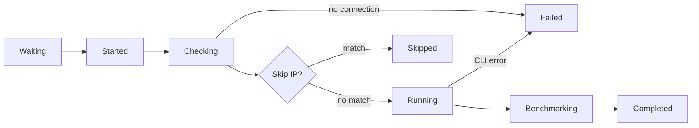

# Speedtest Process

Speedtest Tracker uses the [official Ookla CLI](https://www.speedtest.net/apps/cli) to run speedtests. Every test, scheduled or manual, goes through the same stages. The current stage is shown as the **status** of the result.



### Stages

#### :lucide-hourglass: Waiting

The test is created and queued, waiting for a queue worker to pick it up.

#### :lucide-play: Started

A queue worker has started processing the test.

#### :lucide-wifi: Checking

Speedtest Tracker checks for an internet connection before running the test:

1. It pings [`SPEEDTEST_INTERNET_CHECK_HOSTNAME`](../installation/environment-variables.md#speed-tests) (default `icanhazip.com`).
2. If the ping fails, it falls back to an HTTP request to [`SPEEDTEST_EXTERNAL_IP_URL`](../installation/environment-variables.md#speed-tests).

When both fail, the test is marked as [Failed](#failed). See [Failed to connected to hostname](../help/error-messages.md#speedtest-process).

#### :lucide-skip-forward: Skipped

Only for **scheduled** tests when [`SPEEDTEST_SKIP_IPS`](../installation/environment-variables.md#speed-tests) is set. Speedtest Tracker looks up your external IP address, and when it matches an address or range in the list, the test is marked as skipped and stops here.

#### :lucide-server: Server selection

This step doesn't have its own status. The server is picked in this order:

1. **Manual test with a server selected:** that server is used.
2. **Scheduled test with [`SPEEDTEST_SERVERS`](../installation/environment-variables.md#speed-tests) set:** a random server from the list.
3. **[`SPEEDTEST_BLOCKED_SERVERS`](../installation/environment-variables.md#speed-tests) set:** the nearest server that isn't blocked.
4. **Otherwise:** the Ookla CLI picks the best server itself.

#### :lucide-gauge: Running

The Ookla CLI runs the speedtest and returns the result as JSON:

```bash
speedtest --accept-license --accept-gdpr --selection-details --format=json
```

When a server was selected `--server-id=<id>` is added, and when [`SPEEDTEST_INTERFACE`](../installation/environment-variables.md#speed-tests) is set `--interface=<interface>` is added.

If the CLI returns an error the test is marked as [Failed](#failed). See the [Ookla errors](../help/error-messages.md#ookla-related).

#### :lucide-scale: Benchmarking

Only when thresholds are enabled. The result is compared against your thresholds and marked as **healthy** or **unhealthy**. Without thresholds this stage is skipped.

#### :lucide-circle-check: Completed

The test finished successfully.

#### :lucide-circle-x: Failed

The test couldn't finish, because there was no internet connection during [Checking](#checking) or the Ookla CLI returned an error during [Running](#running). The reason is saved as the message of the result.
