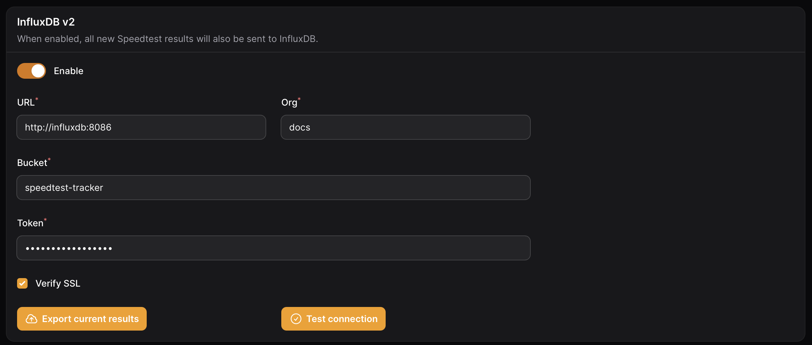

# InfluxDB v2

After every test the Speedtest Tracker can send the results to InfluxDB for long term storage or custom visualizations.

### Settings

To configure Speedtest Tracker to send results to InfluxDB, set the following settings.

| Name | Default | Description |
| --- | --- | --- |
| URL | `blank` | FQDN or IP address to the InfluxDB2 instance |
| Org | `blank` | Organization on which you created your bucket in |
| Bucket | `speedtest-tracker` | The name of the bucket you created in your org |
| Token | `blank` | API token that has access to write to the org and bucket listed above |

<figure markdown="span">
  
  <figcaption>Influxdb v2 Settings</figcaption>
</figure>

If you have a history of results, you can use the `Export current results` feature to export all data to InfluxDB.

### Grafana Dashboard

You can use this community made Grafana Dashboard to visualize your data.

[masterwishx/Speedtest-Tracker-v2-InfluxDBv2](https://github.com/masterwishx/Speedtest-Tracker-v2-InfluxDBv2)

### Data pattern

The Speedtest Tracker exports data in two categories: `Tag` and `Field`. Tags are used for filtering, while fields are used for displaying the data.

| Name | Data Type |  |
| --- | --- | --- |
| `result_id` | `String` | `Tag` |
| `external_ip` | `String` | `Tag` |
| `isp` | `String` | `Tag` |
| `service` | `String` | `Tag` |
| `server_id` | `String` | `Tag` |
| `server_name` | `String` | `Tag` |
| `server_country` | `String` | `Tag` |
| `server_location` | `String` | `Tag` |
| `healthy` | `String` | `Tag` |
| `status` | `String` | `Tag` |
| `scheduled` | `String` | `Tag` |
| `download` | `init` | `Field` |
| `upload` | `init` | `Field` |
| `ping` | `float` | `Field` |
| `download_bits` | `int` | `Field` |
| `upload_bits` | `int` | `Field` |
| `download_jitter` | `float` | `Field` |
| `upload_jitter` | `float` | `Field` |
| `ping_jitter` | `float` | `Field` |
| `download_latency_avg` | `float` | `Field` |
| `download_latency_high` | `float` | `Field` |
| `download_latency_low` | `float` | `Field` |
| `upload_latency_avg` | `float` | `Field` |
| `upload_latency_high` | `float` | `Field` |
| `upload_latency_low` | `float` | `Field` |
| `packet_loss` | `float` | `Field` |
