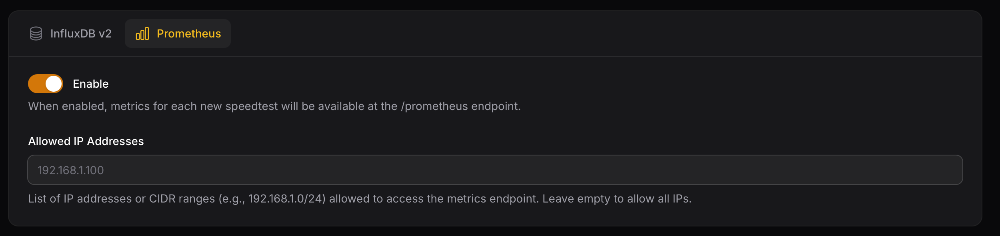

# Prometheus

After each test, Speedtest Tracker exposes the metrics for Prometheus to scrape. For long term storage or custom visualizations.

### Allowed IPs

You can configure the Prometheus endpoint so it’s only accessible from specific IP addresses or networks. This can include single IPs or entire CIDR ranges.



### Grafana Dashboard

You can use this community made Grafana Dashboard to visualize your data.

[CrazyWolf13/Speedtest-Tracker-Prometheus](https://github.com/CrazyWolf13/Speedtest-Tracker-Prometheus)

### Data pattern

Speedtest Tracker exports data in two categories: labels and metrics. Labels are used for filtering, while metrics are used for displaying data.

| Name |  |
| --- | --- |
| `app_name` | `label` |
| `isp` | `label` |
| `server_id` | `label` |
| `server_name` | `label` |
| `server_country` | `label` |
| `server_location` | `label` |
| `healthy` | `label` |
| `status` | `label` |
| `scheduled` | `label` |
| `download_bytes` | `Metric` |
| `upload_bytes` | `Metric` |
| `ping` | `Metric` |
| `download_bits` | `Metric` |
| `upload_bits` | `Metric` |
| `download_jitter` | `Metric` |
| `upload_jitter` | `Metric` |
| `ping_jitter` | `Metric` |
| `download_latency_avg` | `Metric` |
| `download_latency_high` | `Metric` |
| `download_latency_low` | `Metric` |
| `upload_latency_avg` | `Metric` |
| `upload_latency_high` | `Metric` |
| `upload_latency_low` | `Metric` |
| `packet_loss` | `Metric` |

### Prometheus Scrape Config

Below is an example Prometheus scrape configuration:

```yaml
scrape_configs:
  - job_name: 'speedtest-tracker'
    scrape_interval: 60s # Adjust to your set schedule
    scrape_timeout: 10s
    metrics_path: /prometheus
    static_configs:
      - targets: ['speedtest-tracker.local']
```
