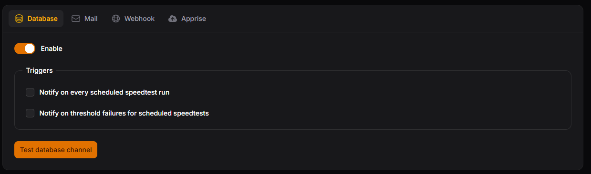

# Database

Database notifications show up in the app under the 🔔 icon in the header. Each notification has a **View** button that opens the results.

!!! info

    Database notifications are sent to **every user**, not only admins.

<figure markdown="span">
  
  <figcaption>Database settings</figcaption>
</figure>

Use **Test database channel** to send a test notification to yourself.

### Triggers

--8<-- "notification-triggers.md"
