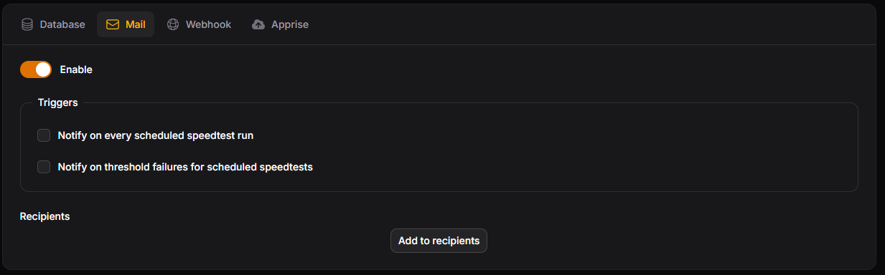

# Mail

Mail notifications are emailed to the list of recipients.

<figure markdown="span">
  
  <figcaption>Mail settings</figcaption>
</figure>

### Setting Up SMTP

Speedtest Tracker sends email over SMTP, so you can use any mail provider that supports it. Set the variables below as environment variables on the container.

!!! warning

    Don't set these in both a `.env` file and your `docker-compose.yml` file, as that can cause issues.

| Variable | Description |
| --- | --- |
| `MAIL_MAILER` | Set to `smtp`. |
| `MAIL_HOST` | Hostname of your SMTP server, e.g. `smtp.gmail.com`. |
| `MAIL_PORT` | Port of your SMTP server, usually `465` (SSL) or `587` (TLS). Check with your mail provider. |
| `MAIL_USERNAME` | Username to log in to the SMTP server. |
| `MAIL_PASSWORD` | Password to log in to the SMTP server. |
| `MAIL_FROM_ADDRESS` | Email address the notifications are sent from. |
| `MAIL_FROM_NAME` | Name the notifications are sent from, e.g. `Speedtest Tracker`. |
| `MAIL_SCHEME` | Optional. Set to `smtp` or `smtps` only if needed, otherwise the scheme is determined from the port. |
| `MAIL_VERIFY_SSL` | Optional. Set to `false` to skip verifying the SSL certificate of the SMTP server. Default: `true`. |

### Examples

=== "Gmail"

    1. Go to your [Google Account](https://myaccount.google.com/) and open the **Security** tab.
    2. Under **How you sign in to Google**, click **2-Step Verification**.
    3. Click **App passwords**.
    4. Enter a name for your app password and click **Create**. Use this password as `MAIL_PASSWORD`.

    ```
    MAIL_MAILER=smtp
    MAIL_HOST=smtp.gmail.com
    MAIL_PORT=465
    MAIL_USERNAME="username@gmail.com"
    MAIL_PASSWORD="password"
    MAIL_FROM_ADDRESS="username@gmail.com"
    MAIL_FROM_NAME="Speedtest Tracker"
    ```

=== "iCloud"

    1. Sign in to your [Apple Account](https://account.apple.com/) and open the **Sign-In and Security** section.
    2. Click **App-Specific Passwords** and generate a new password.
    3. Give it a name, e.g. `Speedtest Tracker`, and copy the generated password. Use this password as `MAIL_PASSWORD`.

    ```
    MAIL_MAILER=smtp
    MAIL_HOST=smtp.mail.me.com
    MAIL_PORT=587
    MAIL_USERNAME="username@icloud.com"
    MAIL_PASSWORD="app-specific-password"
    MAIL_FROM_ADDRESS="username@icloud.com"
    MAIL_FROM_NAME="Speedtest Tracker"
    ```

    !!! info

        - `MAIL_USERNAME` must be your main iCloud email address, even when you send from an alias.
        - `MAIL_FROM_ADDRESS` can be one of your iCloud aliases.
        - Use port `587` (STARTTLS) or `465` (SSL/TLS).

### Recipients

A recipient is any valid email address. You can add one or more recipients that will receive notifications based on the triggers selected.

Use **Test mail channel** to send a test email to all recipients. If no recipients are added you'll see [Add email recipients!](../../help/error-messages.md#notifications).

### Triggers

--8<-- "notification-triggers.md"
