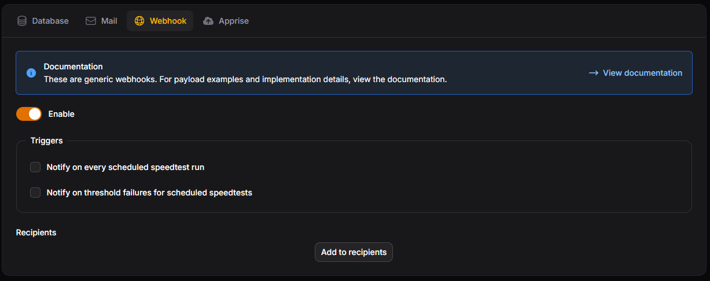

# Webhook

A webhook will send a JSON payload to a receiver of your choice

<figure markdown="span">
  
  <figcaption>Webhook settings</figcaption>
</figure>

### Payload

=== "Threshold Failure"

    ```json
    {
      "result_id": 14,
      "site_name": "Speedtest Tracker",
      "isp": "Speedy Communications",
      "benchmarks": {
        "download": {
          "bar": "min",
          "passed": false,
          "type": "absolute",
          "test_value": 1022,
          "benchmark_value": 2000,
          "unit": "mbps"
        },
        "upload": {
          "bar": "min",
          "passed": false,
          "type": "absolute",
          "test_value": 1018,
          "benchmark_value": 2000,
          "unit": "mbps"
        },
        "ping": {
          "bar": "max",
          "passed": false,
          "type": "absolute",
          "test_value": 3,
          "benchmark_value": 1,
          "unit": "ms"
        }
      },
      "speedtest_url": "https://www.speedtest.net/result/c/1433a2de-eb3c-4a0e-ab29-xxxxxx",
      "url": "http://192.168.1.5/admin/results"
    }
    ```

=== "Completed test"

    ```json
    {
      "result_id": 17,
      "site_name": "Speedtest Tracker",
      "server_name": "Speedtest",
      "server_id": 52365,
      "status": "completed",
      "isp": "Speedy Communications",
      "ping": 3,
      "download": 1026,
      "upload": 1012,
      "packet_loss": 0,
      "speedtest_url": "https://www.speedtest.net/result/c/288aa4aa-a52e-493c-8d60-xxxx",
      "url": "http://192.168.1.5/admin/results"
    }
    ```

### Triggers

| Name | Description |
| --- | --- |
| on every scheduled speedtest run | On each successful scheduled speedtest a notification will be send to the application. |
| on threshold failures for scheduled speedtests | On any absolute threshold failure for scheduled speedtest a notification will be send to the application. |
